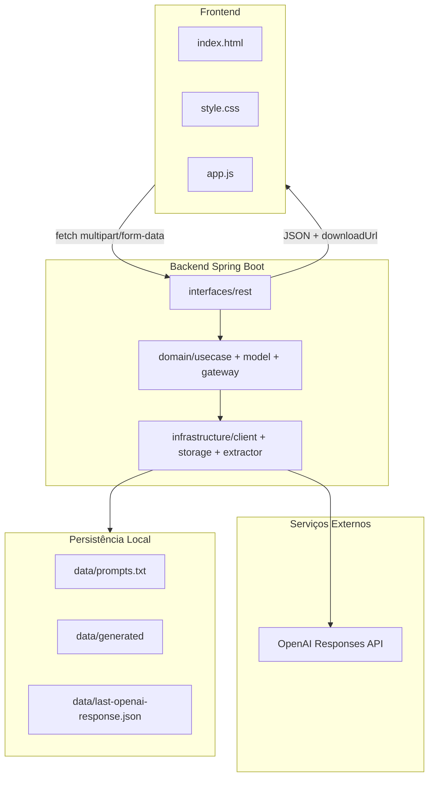

# Document Studio IA — Gerador de Documentos com OpenAI


Interface moderna e backend Spring Boot para gerar documentos com IA a partir de um prompt e, opcionalmente, um arquivo de apoio. O sistema recebe uploads em `multipart/form-data`, extrai contexto de anexos `pdf`, `docx`, `xlsx` e `txt`, chama a OpenAI Responses API e disponibiliza o arquivo final para download.

> Projeto publicado em: `https://github.com/professorpaulojca/interface-open-ia.git`

---

## Sumário

- [Visão Geral](#visão-geral)
- [Principais Recursos](#principais-recursos)
- [Demonstração do Fluxo](#demonstração-do-fluxo)
- [Arquitetura](#arquitetura)
- [Stack Técnica](#stack-técnica)
- [Estrutura do Projeto](#estrutura-do-projeto)
- [Como Executar](#como-executar)
- [Configuração de Ambiente](#configuração-de-ambiente)
- [Como Usar](#como-usar)
- [Endpoints](#endpoints)
- [Persistência Local](#persistência-local)
- [Segurança](#segurança)
- [Troubleshooting](#troubleshooting)
- [Próximos Passos](#próximos-passos)

---

## Visão Geral

O **Document Studio IA** é uma aplicação full stack didática e funcional composta por:

- Um **frontend moderno** em HTML, CSS e JavaScript Vanilla.
- Um **backend Java Spring Boot** organizado por camadas inspiradas em Clean Architecture/Hexagonal Architecture.
- Integração com a **OpenAI Responses API**.
- Geração de arquivos `docx`, `xlsx` ou `txt`, conforme o tipo de solicitação do usuário.
- Upload opcional de arquivo de apoio para enriquecer o contexto enviado à IA.
- Histórico local de prompts e links de arquivos gerados.

O objetivo é entregar uma experiência simples para o usuário final e, ao mesmo tempo, um código organizado para estudo, extensão e manutenção.

---

## Principais Recursos

### Experiência do Usuário

- Interface escura moderna com estilo **glassmorphism**.
- Layout responsivo para desktop, tablet e mobile.
- Upload por clique ou **drag-and-drop**.
- Feedback de estado sem recarregar a página.
- Prévia do arquivo selecionado com nome, extensão e tamanho.
- Métricas de sessão: requisições, sucessos e taxa de sucesso.
- Resultado renderizado em tempo real com link para baixar novamente.
- Histórico sincronizado via API, sem `reload` da tela.

### Backend e Integração IA

- Endpoint `multipart/form-data` para `prompt` + `file` opcional.
- Validação de anexos por extensão e tamanho.
- Extração de texto local para `pdf`, `docx`, `xlsx` e `txt`.
- Detecção automática do tipo de documento pelo prompt.
- Uso de `code_interpreter` quando o prompt indica `docx` ou `xlsx`.
- Download do arquivo gerado no container da OpenAI.
- Persistência local dos arquivos finais em `data/generated`.
- Histórico em arquivo texto com links de download.
- Tratamento centralizado de erros via `GlobalExceptionHandler`.

---

## Demonstração do Fluxo


---

## Arquitetura

A documentação completa da arquitetura está em:

📌 [`docs/ARQUITETURA.md`](docs/ARQUITETURA.md)

Ela contém diagramas detalhados de:

- Visão geral frontend/backend/OpenAI/storage.
- Camadas do backend.
- Fluxo de geração de documento.
- Fluxo de download.
- Fluxo de histórico.
- Persistência local.

### Resumo Arquitetural



---

## Stack Técnica

| Área | Tecnologia |
|---|---|
| Linguagem backend | Java 17 |
| Framework backend | Spring Boot 3.4.5 |
| API REST | Spring Web |
| Validação | Spring Validation + regras de domínio |
| OpenAPI/Swagger | `springdoc-openapi` |
| Integração IA | OpenAI Responses API |
| Cliente HTTP | `java.net.http.HttpClient` |
| PDF | Apache PDFBox |
| DOCX/XLSX | Apache POI |
| Frontend | HTML5, CSS3, JavaScript Vanilla |
| Persistência | File System local |
| Build | Maven |

---

## Estrutura do Projeto

```text
gerador-ia-code-interpreter/
├── README.md
├── docs/
│   └── ARQUITETURA.md
├── frontend/
│   ├── index.html
│   ├── style.css
│   └── app.js
└── backend/
    ├── pom.xml
    ├── .env.example
    └── src/main/
        ├── java/br/com/aula/gerador/
        │   ├── GeradorIaApplication.java
        │   ├── application/service/
        │   ├── domain/
        │   │   ├── exception/
        │   │   ├── gateway/
        │   │   ├── model/
        │   │   ├── usecase/
        │   │   └── validation/
        │   ├── infrastructure/
        │   │   ├── client/
        │   │   ├── config/
        │   │   ├── extractor/
        │   │   └── storage/
        │   └── interfaces/rest/
        │       ├── dto/
        │       ├── exception/
        │       └── mapper/
        └── resources/
            └── application.properties
```

---

## Como Executar

### Pré-requisitos

- Java 17+
- Maven 3.9+
- Chave da OpenAI configurada em variável de ambiente
- Navegador moderno
- Opcional: VS Code + extensão Live Server

### 1. Clonar o repositório

```powershell
git clone https://github.com/professorpaulojca/interface-open-ia.git
Set-Location interface-open-ia
```

### 2. Configurar ambiente do backend

```powershell
Copy-Item backend\.env.example backend\.env
```

Edite `backend/.env` e configure:

```dotenv
OPENAI_API_KEY=coloque_sua_chave_real_aqui
OPENAI_MODEL=gpt-4.1-mini
OPENAI_BASE_URL=https://api.openai.com/v1
OPENAI_CODE_INTERPRETER_MEMORY=1g
MAX_ATTACHMENT_BYTES=5242880
MAX_ATTACHMENT_CHARS=60000
PROMPT_FILE=data/prompts.txt
GENERATED_FILES_DIR=data/generated
PUBLIC_BASE_URL=http://localhost:8080
```

Também é possível usar variáveis do Windows:

```powershell
setx OPENAI_API_KEY "sua_chave_aqui"
setx OPENAI_MODEL "gpt-4.1-mini"
```

Depois de usar `setx`, feche e abra o terminal novamente.

### 3. Rodar o backend

```powershell
Set-Location backend
mvn spring-boot:run
```

O backend ficará disponível em:

```text
http://localhost:8080
```

### 4. Rodar o frontend

Opção simples:

```text
Abra frontend/index.html no navegador.
```

Opção recomendada no VS Code:

```text
Abra frontend/index.html com Live Server.
```

---

## Configuração de Ambiente

As configurações principais ficam em `backend/src/main/resources/application.properties` e podem ser sobrescritas pelo arquivo `backend/.env`.

| Variável | Padrão | Descrição |
|---|---:|---|
| `OPENAI_API_KEY` | vazio | Chave usada para autenticar na OpenAI. |
| `OPENAI_MODEL` | `gpt-4.1-mini` | Modelo usado na Responses API. |
| `OPENAI_BASE_URL` | `https://api.openai.com/v1` | Base URL da API. |
| `OPENAI_CODE_INTERPRETER_MEMORY` | `1g` | Memória do container do Code Interpreter. |
| `MAX_ATTACHMENT_BYTES` | `5242880` | Limite de tamanho validado no domínio. |
| `MAX_ATTACHMENT_CHARS` | `60000` | Limite de caracteres extraídos do anexo. |
| `PROMPT_FILE` | `data/prompts.txt` | Arquivo local de histórico. |
| `GENERATED_FILES_DIR` | `data/generated` | Diretório dos arquivos gerados. |
| `PUBLIC_BASE_URL` | `http://localhost:8080` | Base para links salvos no histórico. |

---

## Como Usar

### Pela interface web

1. Abra o frontend.
2. Digite um prompt detalhado.
3. Opcionalmente, arraste ou selecione um arquivo `pdf`, `docx`, `xlsx` ou `txt`.
4. Clique em **Gerar arquivo**.
5. Aguarde a geração.
6. O navegador baixa o arquivo automaticamente.
7. Use **Baixar novamente** se precisar recuperar o último resultado.

### Exemplos de prompt

Prompt para Excel:

```text
Gere uma planilha Excel com 10 produtos de papelaria, contendo produto, quantidade, preço unitário, subtotal e uma linha final com o total geral.
```

Prompt para Word:

```text
Gere um documento Word explicando de forma didática o que é uma API REST, com título, seções, exemplos práticos e conclusão.
```

Prompt usando anexo:

```text
Leia o conteúdo do anexo e gere uma planilha xlsx com os pontos principais, responsáveis, prazos e status sugerido.
```

---

## Endpoints

Base URL local:

```text
http://localhost:8080/api/documentos
```

### Gerar documento

```http
POST /api/documentos/gerar
Content-Type: multipart/form-data
```

Campos:

| Campo | Obrigatório | Tipo | Descrição |
|---|---:|---|---|
| `prompt` | Sim | Texto | Instrução enviada à IA. |
| `file` | Não | Arquivo | Anexo opcional `pdf`, `docx`, `xlsx` ou `txt`. |

Exemplo com `curl`:

```powershell
curl.exe -X POST "http://localhost:8080/api/documentos/gerar" `
  -F "prompt=Resuma o conteúdo do anexo em uma planilha xlsx" `
  -F "file=@./meu_documento.pdf"
```

Resposta:

```json
{
  "mensagem": "Arquivo gerado com sucesso.",
  "id": "b1e7d5b0-0000-0000-0000-abc123",
  "filename": "resposta_ia.xlsx",
  "contentType": "application/vnd.openxmlformats-officedocument.spreadsheetml.sheet",
  "size": 12345,
  "downloadUrl": "/api/documentos/download/b1e7d5b0-0000-0000-0000-abc123"
}
```

### Baixar arquivo gerado

```http
GET /api/documentos/download/{id}
```

Retorna bytes do arquivo com `Content-Disposition: attachment`.

### Consultar histórico

```http
GET /api/documentos/historico
```

Resposta:

```json
{
  "historico": "..."
}
```

### Limpar histórico

```http
DELETE /api/documentos/historico
```

Resposta:

```json
{
  "mensagem": "Histórico de prompts apagado com sucesso."
}
```

---

## Persistência Local

Por padrão, o backend grava dados locais dentro de `backend/data` quando executado a partir da pasta `backend`.

```text
backend/data/
├── prompts.txt
├── last-openai-response.json
└── generated/
    └── {uuid}_resposta_ia.xlsx
```

| Arquivo/Diretório | Função |
|---|---|
| `data/prompts.txt` | Histórico textual de prompts e links gerados. |
| `data/generated` | Arquivos finais disponíveis para download. |
| `data/last-openai-response.json` | Última resposta bruta da OpenAI para depuração. |

Esses arquivos são ignorados pelo Git via `.gitignore`.

---

## Segurança

- Nunca versionar `backend/.env`.
- Nunca colocar `OPENAI_API_KEY` em código, README, prints ou commits.
- O arquivo `backend/.env.example` deve conter apenas placeholders.
- O frontend não fala diretamente com a OpenAI; ele chama apenas o backend local.
- O backend valida extensão e tamanho de anexos antes do processamento.
- IDs de download são validados para evitar path traversal.
- Se uma chave for exposta acidentalmente, revogue/rotacione imediatamente no painel da OpenAI.

---

## Troubleshooting

### `Backend offline ou inacessível em http://localhost:8080`

Verifique se o backend está rodando:

```powershell
Set-Location backend
mvn spring-boot:run
```

### `A variável de ambiente OPENAI_API_KEY não foi configurada`

Configure `backend/.env` ou use `setx`:

```powershell
setx OPENAI_API_KEY "sua_chave_aqui"
```

Depois reabra o terminal.

### `Extensão não suportada`

Use apenas:

```text
pdf, docx, xlsx, txt
```

### Arquivo muito grande

Confira os limites:

- `spring.servlet.multipart.max-file-size=25MB`
- `spring.servlet.multipart.max-request-size=30MB`
- `MAX_ATTACHMENT_BYTES=5242880`

### A OpenAI respondeu, mas não veio arquivo

Para prompts que pedem `docx` ou `xlsx`, o backend espera uma anotação `container_file_citation`.

Verifique:

```text
backend/data/last-openai-response.json
```

---

## Desenvolvimento

### Compilar backend

```powershell
Set-Location backend
mvn -q -DskipTests compile
```

### Rodar testes Maven

```powershell
Set-Location backend
mvn test
```

### Swagger/OpenAPI

Com o backend rodando, acesse:

```text
http://localhost:8080/swagger-ui.html
```

ou:

```text
http://localhost:8080/swagger-ui/index.html
```

---

## Próximos Passos

- Adicionar autenticação de usuário.
- Persistir histórico em banco de dados.
- Exibir progresso por etapas na interface.
- Adicionar pré-validação visual mais detalhada do upload.
- Criar suíte de testes automatizados para use cases e adapters.
- Publicar backend e frontend em ambiente cloud.
- Adicionar fila para processamentos longos.

---

## Licença

Projeto didático para estudo de integração entre frontend, Spring Boot e OpenAI Responses API.
