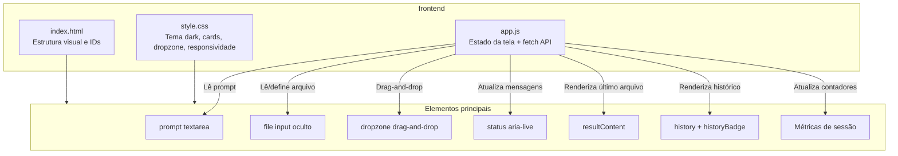
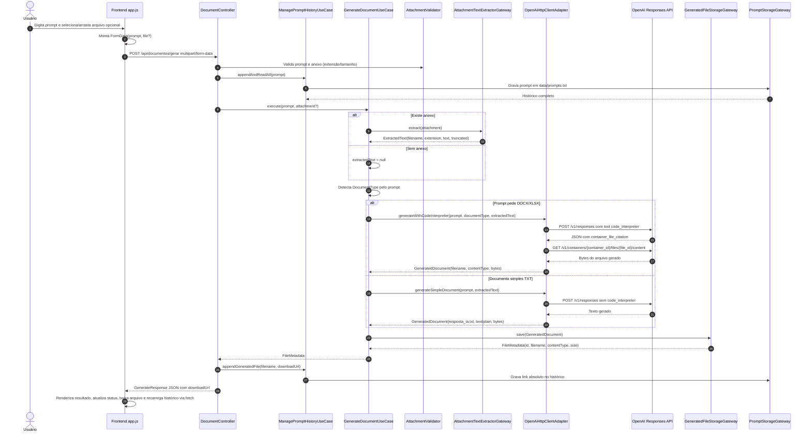
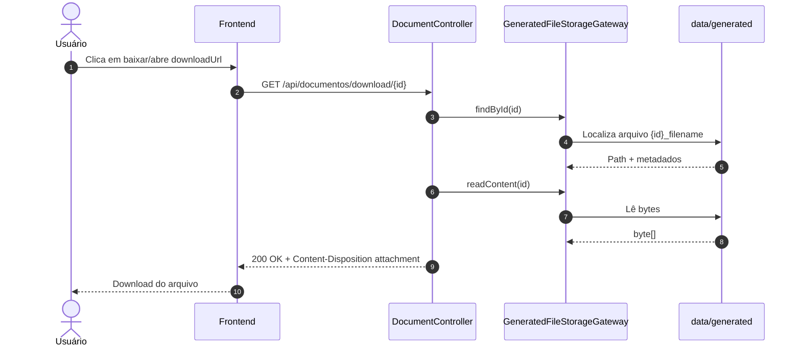
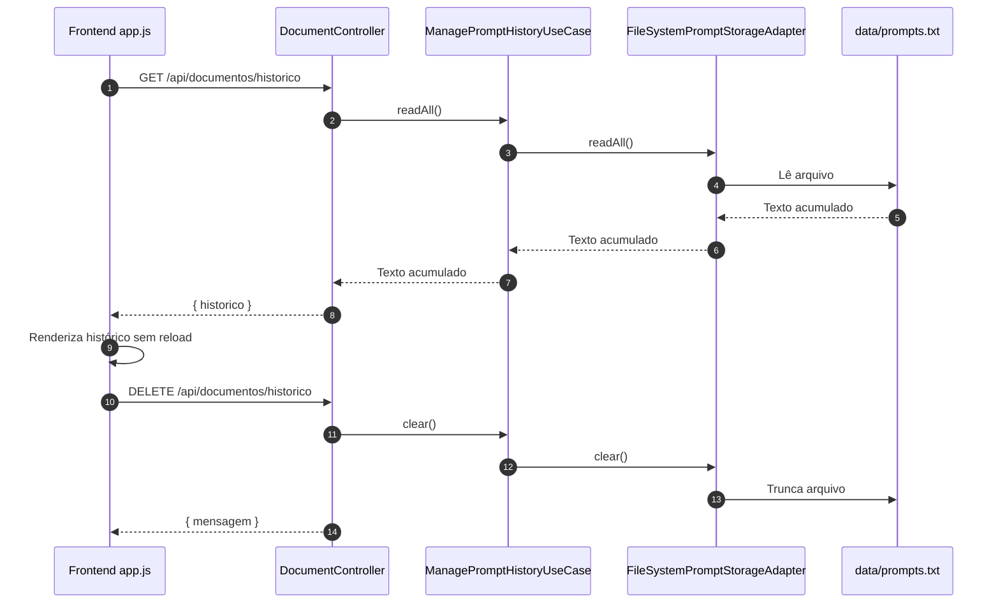
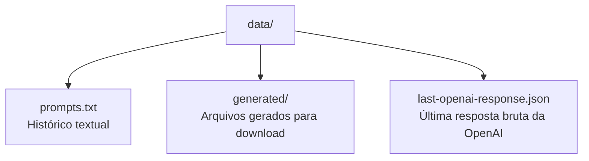

# Arquitetura do Projeto

Este documento descreve a arquitetura atual do projeto `gerador-ia-code-interpreter`, considerando o código do frontend e do backend como estão no workspace.

> Observação importante: no estado atual do código, o backend recebe `multipart/form-data` com `prompt` e `file` opcional, valida o anexo e extrai texto localmente. O anexo não é enviado como binário para `POST /v1/files`; o texto extraído é incluído no `input_text` da chamada `POST /v1/responses`.

## Visão Geral

```mermaid
flowchart LR
    user[Usuário]
    browser[Frontend\nHTML + CSS + JavaScript]
    api[Backend Spring Boot\nREST API]
    openai[OpenAI API\nResponses + Code Interpreter]
    fs[(File System\ndata/prompts.txt\ndata/generated/*\ndata/last-openai-response.json)]

    user -->|Prompt + anexo opcional| browser
    browser -->|POST multipart/form-data\n/api/documentos/gerar| api
    browser -->|GET /historico\nDELETE /historico\nGET /download/{id}| api
    api -->|POST /v1/responses| openai
    api -->|GET /v1/containers/{container_id}/files/{file_id}/content| openai
    api -->|Lê/grava histórico e arquivos| fs
    api -->|JSON com downloadUrl| browser
    browser -->|Atualização assíncrona sem reload| user
```

## Camadas do Backend

O backend está organizado em uma arquitetura parecida com Clean Architecture/Hexagonal Architecture:

```mermaid
flowchart TB
    subgraph Interfaces[interfaces/rest]
        Controller[DocumentController]
        ExceptionHandler[GlobalExceptionHandler]
        DTOs[DTOs REST\nGenerateResponse, ApiError]
        Mapper[AttachmentMapper]
    end

    subgraph Domain[domain]
        UseCaseGenerate[GenerateDocumentUseCase]
        UseCaseHistory[ManagePromptHistoryUseCase]
        Models[Modelos de domínio\nAttachment, FileMetadata, GeneratedDocument,\nDocumentType, DownloadUrl, ExtractedText]
        Validation[AttachmentValidator]
        Gateways[Gateways\nOpenAiClientGateway\nGeneratedFileStorageGateway\nPromptStorageGateway\nAttachmentTextExtractorGateway]
        Exceptions[Exceções de domínio]
    end

    subgraph Application[application/service]
        PromptBuilder[OpenAiPromptBuilder]
        ResponseParser[OpenAiResponseParser]
        ErrorMapper[OpenAiErrorMapper]
        Formatter[HistoryEntryFormatter]
        Resolver[ContentTypeResolver]
        Normalizer[FilenameNormalizer]
        Logger[OperationLogger]
    end

    subgraph Infrastructure[infrastructure]
        OpenAIAdapter[OpenAiHttpClientAdapter]
        PromptStorage[FileSystemPromptStorageAdapter]
        FileStorage[FileSystemGeneratedFileStorageAdapter]
        ExtractorAdapter[AttachmentTextExtractorAdapter]
        Extractors[TextExtractor implementations\nPdfTextExtractor, DocxTextExtractor,\nXlsxTextExtractor, TxtTextExtractor]
        Config[AppConfig, CorsConfig, OpenApiConfig]
    end

    Controller --> Mapper
    Controller --> Validation
    Controller --> UseCaseGenerate
    Controller --> UseCaseHistory
    Controller --> Gateways
    ExceptionHandler --> Exceptions
    UseCaseGenerate --> Models
    UseCaseGenerate --> Gateways
    UseCaseHistory --> Gateways
    OpenAIAdapter -.implementa.-> Gateways
    PromptStorage -.implementa.-> Gateways
    FileStorage -.implementa.-> Gateways
    ExtractorAdapter -.implementa.-> Gateways
    ExtractorAdapter --> Extractors
    OpenAIAdapter --> PromptBuilder
    OpenAIAdapter --> ResponseParser
    OpenAIAdapter --> ErrorMapper
    OpenAIAdapter --> Resolver
    OpenAIAdapter --> Normalizer
    PromptStorage --> Formatter
    Config --> UseCaseGenerate
    Config --> UseCaseHistory
```



## Arquitetura do Frontend



## Fluxo de Geração de Documento



## Fluxo de Download



## Fluxo de Histórico



## Componentes e Responsabilidades

| Camada | Componente | Responsabilidade |
|---|---|---|
| Frontend | `index.html` | Estrutura da tela, campos, dropzone, cards e áreas de resultado/histórico. |
| Frontend | `app.js` | Sincronização assíncrona via `fetch`, `FormData`, estados de loading/sucesso/erro, drag-and-drop e renderização sem reload. |
| Frontend | `style.css` | Tema visual moderno, responsividade, cards, chips, status e dropzone. |
| Interface REST | `DocumentController` | Expõe endpoints `/gerar`, `/download/{id}`, `/historico`; valida prompt/anexo e coordena use cases. |
| Interface REST | `GlobalExceptionHandler` | Converte exceções de domínio/infra em respostas JSON padronizadas. |
| Domínio | `GenerateDocumentUseCase` | Orquestra extração de texto do anexo, detecção do tipo de documento, chamada à OpenAI e persistência do arquivo. |
| Domínio | `ManagePromptHistoryUseCase` | Lê, grava e limpa histórico de prompts/arquivos gerados. |
| Domínio | `AttachmentValidator` | Valida extensão e tamanho do anexo. |
| Infraestrutura | `OpenAiHttpClientAdapter` | Implementa chamadas HTTP para `/v1/responses` e download de arquivos de container. |
| Infraestrutura | `AttachmentTextExtractorAdapter` | Escolhe extrator adequado para `pdf`, `docx`, `xlsx` ou `txt` e limita texto extraído. |
| Infraestrutura | `FileSystemGeneratedFileStorageAdapter` | Salva arquivos gerados em `data/generated` e recupera por `id`. |
| Infraestrutura | `FileSystemPromptStorageAdapter` | Mantém o histórico em `data/prompts.txt`. |

## Endpoints

```mermaid
flowchart LR
    API[/api/documentos/]
    Gerar[POST /gerar\nmultipart/form-data\nprompt + file?]
    Download[GET /download/{id}\nbytes + attachment header]
    Historico[GET /historico\nJSON com texto acumulado]
    Limpar[DELETE /historico\nlimpa prompts.txt]

    API --> Gerar
    API --> Download
    API --> Historico
    API --> Limpar
```

### `POST /api/documentos/gerar`

- `Content-Type`: `multipart/form-data` ou `application/x-www-form-urlencoded`.
- Campos:
  - `prompt`: obrigatório.
  - `file`: opcional.
- Extensões aceitas pelo domínio: `pdf`, `docx`, `xlsx`, `txt`.
- Retorno: `GenerateResponse` com `mensagem`, `id`, `filename`, `contentType`, `size`, `downloadUrl`.

## Persistência Local



## Configurações Relevantes

| Propriedade | Uso |
|---|---|
| `server.port` | Porta HTTP do Spring Boot. |
| `spring.servlet.multipart.max-file-size` | Limite máximo por arquivo multipart. |
| `spring.servlet.multipart.max-request-size` | Limite máximo da requisição multipart. |
| `openai.api-key` | Chave da OpenAI via `OPENAI_API_KEY`. |
| `openai.model` | Modelo usado nas chamadas Responses API. |
| `openai.base-url` | Base URL da OpenAI. |
| `openai.code-interpreter-memory` | Memória do container do Code Interpreter. |
| `app.max-attachment-bytes` | Limite de tamanho validado no domínio para o anexo. |
| `app.max-attachment-chars` | Máximo de caracteres extraídos do anexo. |
| `app.prompt-file` | Caminho do arquivo de histórico. |
| `app.generated-files-dir` | Diretório dos arquivos gerados. |
| `app.public-base-url` | Base usada para registrar links absolutos no histórico. |

## Observações Técnicas

- O frontend não recarrega a página; toda sincronização é feita por `fetch` e atualização do DOM.
- O envio do frontend não define manualmente o header `Content-Type`; o navegador monta o boundary correto do `multipart/form-data`.
- O backend salva o último JSON bruto da OpenAI em `data/last-openai-response.json` para depuração.
- Para DOCX/XLSX, a resposta precisa conter `container_file_citation`; caso contrário, o backend lança `DocumentGenerationException`.
- O histórico pode conter links HTML gerados pelo backend; o frontend só renderiza links de download permitidos.